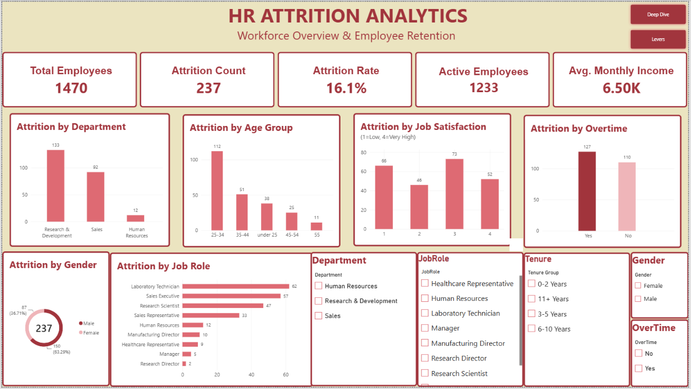
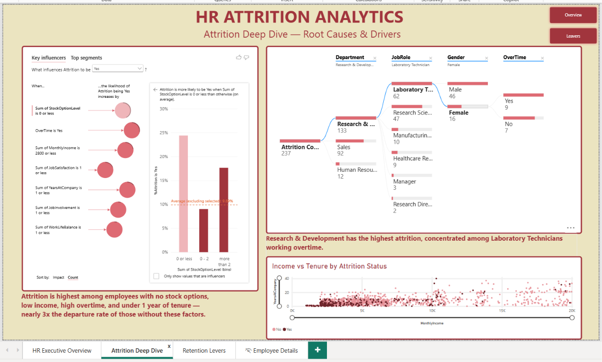
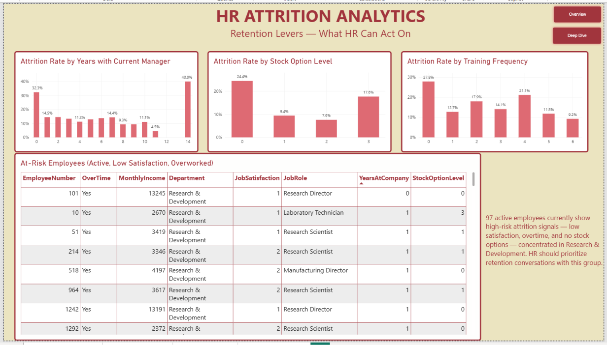
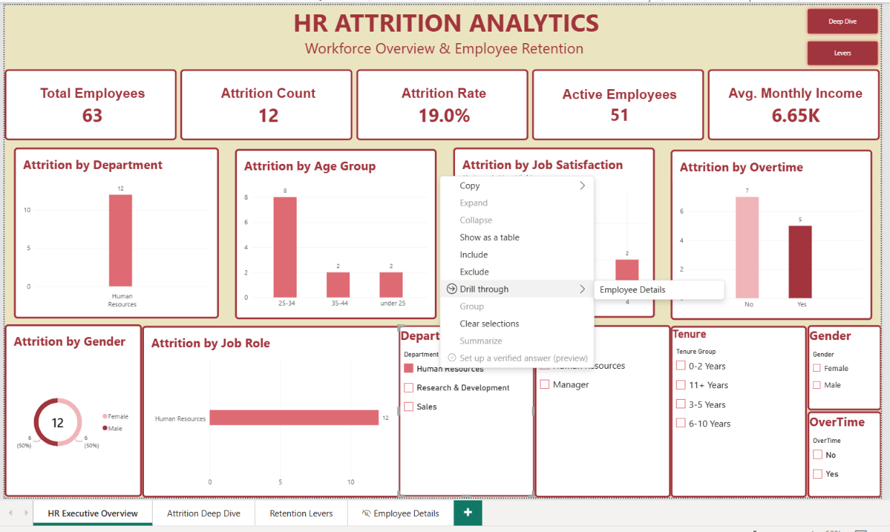
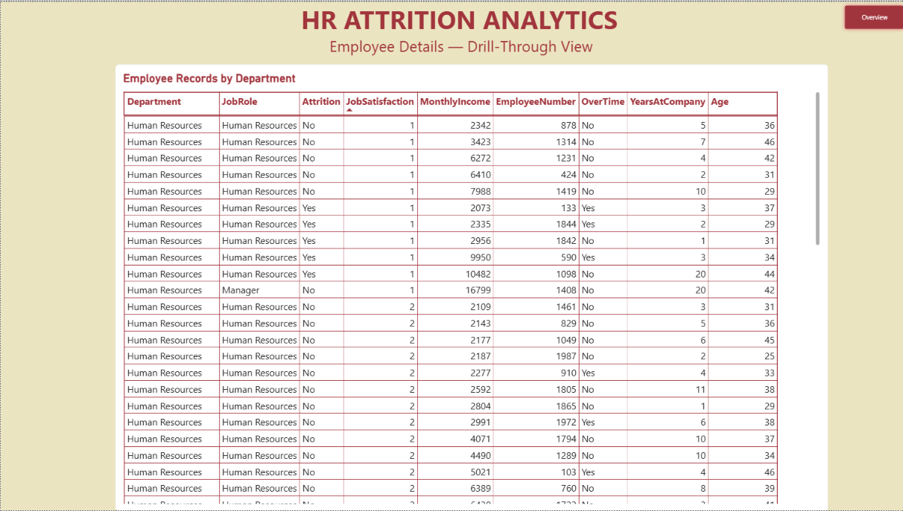

# 📊 HR Attrition Analytics Dashboard (Power BI)

**Name:** Akanksha Yadav <br>
**Roll No:** TDS2627062

---

## 📌 Overview

This project is an interactive Power BI dashboard that analyses **employee attrition** across a workforce of **1,470 employees**. It answers three questions for HR leaders:

1. **Who is leaving?** (department, job role, age group, gender, tenure)
2. **Why are they leaving?** (overtime, job satisfaction, income, stock options, work-life balance)
3. **Who is at risk next, and what can HR do about it?**

The report has four linked pages: an Executive Overview, an Attrition Deep Dive, a Retention Levers page and a hidden Employee Details page reached by drill-through.

---

## 🎯 Objectives

- Measure overall attrition and see how it varies across departments, roles, age groups and genders.
- Identify the main drivers of attrition using Key Influencers and the Decomposition Tree.
- Find the retention factors HR can act on (stock options, training, manager tenure).
- Produce a list of currently active, high-risk employees for retention conversations.

---

## 🗂️ Dataset

**Name:** IBM HR Analytics Employee Attrition & Performance (`WA_Fn-UseC_-HR-Employee-Attrition.xlsx`)
**Size:** 1,470 employee records × 35 columns
**Outcome column:** `Attrition` (Yes = 237 employees, No = 1,233 employees)

**Columns used in the dashboard:**

| Category        | Fields                                                                                                   |
| --------------- | -------------------------------------------------------------------------------------------------------- |
| Demographics    | `Age`, `Gender`                                                                                          |
| Job details     | `Department`, `JobRole`, `OverTime`, `YearsAtCompany`, `YearsWithCurrManager`, `EmployeeNumber`          |
| Pay and rewards | `MonthlyIncome`, `PercentSalaryHike`, `StockOptionLevel`                                                 |
| Engagement      | `JobSatisfaction` (1 = Low, 4 = Very High), `WorkLifeBalance`, `JobInvolvement`, `TrainingTimesLastYear` |
| Outcome         | `Attrition`                                                                                              |

---

## ⚙️ Data Preparation

### 🧮 Calculated Columns

- **`Age Group`**: employees bucketed into _under 25, 25-34, 35-44, 45-54, 55+_
- **`Tenure Group`**: employees bucketed by `YearsAtCompany` into _0-2, 3-5, 6-10, 11+ years_

### 📈 DAX Measures

| Measure                  | Purpose                                  |
| ------------------------ | ---------------------------------------- |
| `Total Employees`        | Count of all employees                   |
| `Attrition Count`        | Number of employees with Attrition = Yes |
| `Attrition Rate`         | Attrition Count ÷ Total Employees        |
| `Active Employees`       | Employees who have not left              |
| `Average Monthly Income` | Average of `MonthlyIncome`               |

---

## 📊 Dashboard Pages

### 1️⃣ HR Executive Overview



The landing page, giving a high-level view of attrition across the company.

**KPI cards:** Total Employees **1,470** · Attrition Count **237** · Attrition Rate **16.1%** · Active Employees **1,233** · Avg. Monthly Income **6.50K**

**Visuals:**

- Column chart: Attrition by Department
- Column chart: Attrition by Age Group
- Column chart: Attrition by Job Satisfaction (1 = Low, 4 = Very High)
- Column chart: Attrition by Overtime
- Donut chart: Attrition by Gender
- Bar chart: Attrition by Job Role

**Slicers:** Department, Job Role, Tenure Group, Gender, OverTime (every visual on the page responds to them)

**Navigation:** buttons to the _Deep Dive_ and _Retention Levers_ pages

---

### 2️⃣ Attrition Deep Dive



Root-cause analysis using Power BI's AI-powered visuals.

**Visuals:**

- **Key Influencers** with the target set to `Attrition = Yes`. The strongest factors are: no stock options, working overtime, monthly income of 2,800 or less, job satisfaction of 1, one year or less at the company, job involvement of 1 and work-life balance of 1.
- **Decomposition Tree** breaking the 237 leavers down by Department → Job Role → Gender → OverTime.
- **Scatter chart** of Monthly Income vs Years at Company, coloured by Attrition status.
- Two written insight callouts summarising the findings.

**Navigation:** buttons to the _Overview_ and _Retention Levers_ pages

---

### 3️⃣ Retention Levers



Focuses on the factors HR can actually change.

**Visuals:**

- Attrition Rate by Years with Current Manager
- Attrition Rate by Stock Option Level
- Attrition Rate by Training Frequency
- At-Risk Employees table: active employees with low job satisfaction who work overtime, showing Employee Number, Overtime, Monthly Income, Department, Job Satisfaction, Job Role, Years at Company and Stock Option Level
- An insight callout on the high-risk group

**Navigation:** buttons to the _Overview_ and _Deep Dive_ pages

---

### 4️⃣ Employee Details (Drill-through)

**Step 1: Right-click a department on the Overview page → Drill through → Employee Details**



**Step 2: The hidden Employee Details page opens, filtered to that department**



The page lists the underlying employee records (Department, Job Role, Attrition, Job Satisfaction, Monthly Income, Employee Number, OverTime, Years at Company and Age), so any number on the dashboard can be checked against the raw data. An **Overview** button returns to the main report.

---

## 🔑 Key Insights

- **Overall attrition is 16.1%:** 237 of 1,470 employees have left.
- **Department:** Research & Development has the most leavers (**133**), followed by Sales (**92**) and Human Resources (**12**).
- **Job role:** Laboratory Technicians (**62**), Sales Executives (**57**) and Research Scientists (**47**) are the most affected roles.
- **Age:** The **25-34** age group has the most leavers (**112**), followed by 35-44 (51) and under 25 (38).
- **Gender:** Male employees account for **150** leavers (63.3%) and female employees for **87** (36.7%).
- **Overtime:** **127** leavers worked overtime, compared with 110 who did not.
- **Stock options:** Employees with no stock options leave at **24.4%**, versus 9.4% at level 1 and 7.6% at level 2.
- **Manager tenure:** Attrition is **32.3%** among employees with 0 years under their current manager.
- **Training:** Employees with no training last year leave at **27.8%**, the highest of any training group.
- **Combined risk:** Attrition is highest among employees with no stock options, low income, high overtime and under one year of tenure, nearly **3x** the departure rate of those without these factors.
- **Hotspot:** Research & Development has the highest attrition, concentrated among Laboratory Technicians working overtime.
- **Action list:** **97 active employees** currently show high-risk signals (low satisfaction, overtime, no stock options), concentrated in Research & Development.

---

## 💡 Recommendations

- Prioritise retention conversations with the 97 active employees on the At-Risk list.
- Review overtime workloads in Research & Development, especially for Laboratory Technicians.
- Extend stock option eligibility to employees currently at level 0.
- Strengthen onboarding and early-tenure support, as first-year employees are the most likely to leave.
- Ensure every employee receives regular training and a stable manager relationship.

---

## ✅ Conclusion

The dashboard shows that attrition is not random: it is concentrated in specific departments, roles and employee profiles, and it is strongly linked to overtime, low pay, missing stock options, low satisfaction and short tenure. By combining an executive summary, root-cause analysis and an action-oriented risk list, it lets HR move from _reporting_ attrition to _preventing_ it.

---

## 📁 Project Structure

```
hr-attrition-dashboard-powerbi/
│
├── data/
│   └── HR_Employee_Attrition.xlsx
│
├── images/
│   ├── hrOverview.png                          # Executive Overview page
│   ├── hrDeepDive.png                          # Attrition Deep Dive page
│   ├── hrLevers.png                            # Retention Levers page
│   ├── hrDrillThrough.png                      # Drill-through menu
│   └── hrDetails.png                           # Employee Details page
│
├── powerBI/
│   └── HR_Attrition_Analytics.pbix             # Power BI dashboard
│
└── README.md
```

---

## 🛠 Tools Used

- **Power BI Desktop**: report design, Key Influencers, Decomposition Tree, drill-through and page navigation
- **Power Query**: loading and preparing the Excel dataset
- **DAX**: calculated columns and measures for attrition count, attrition rate and averages

---

## 👤 Author

**Akanksha**
